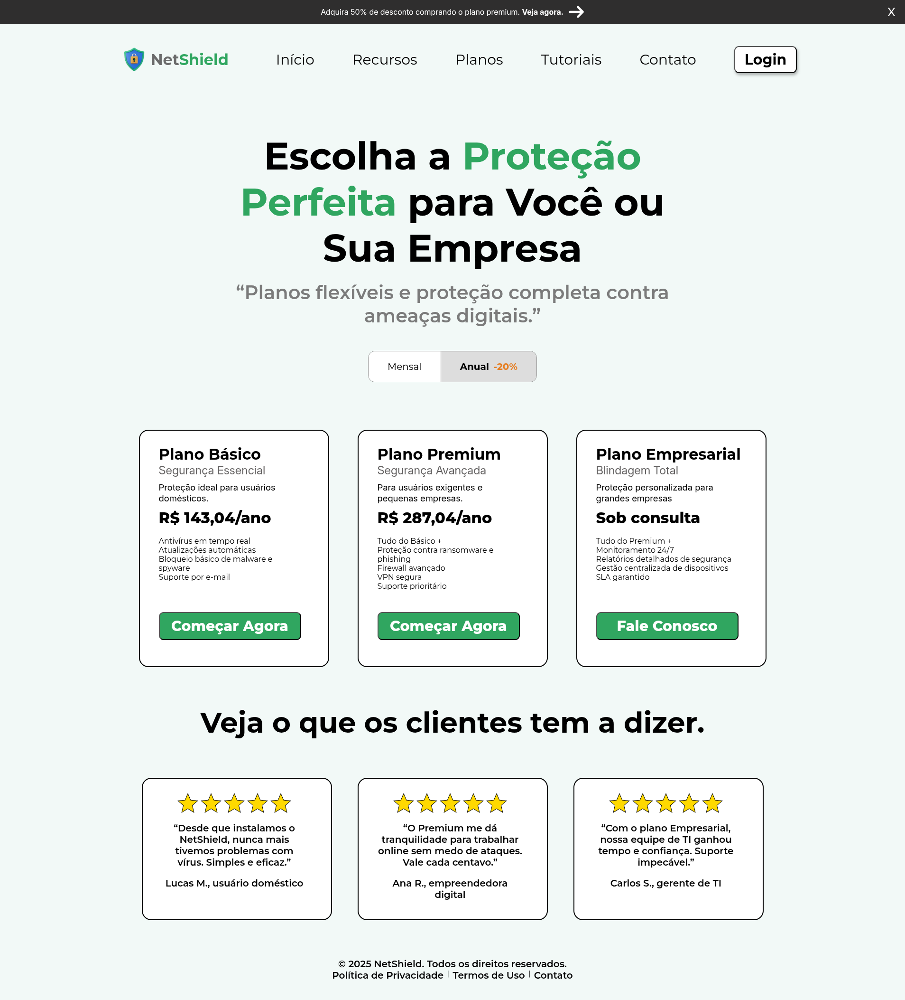

# 🛡️ Netshield

  
  
  
  

> Uma landing page fictícia para um produto antivírus, criada com o objetivo de praticar **HTML, CSS e JavaScript** — com foco em **responsividade** e na implementação de um **menu hambúrguer**.

---

## 🚀 Objetivo do Projeto
Este projeto foi desenvolvido com fins educativos, visando:

- Praticar a construção de layouts responsivos.
- Aprender a manipular elementos HTML e estilização com CSS.
- Implementar interações básicas com JavaScript.
- Exercitar boas práticas de estruturação e organização de código front-end.

---

## 🧩 Tecnologias Utilizadas
- **HTML5** — estrutura da página  
- **CSS3** — estilos, design e responsividade  
- **JavaScript** — interatividade (menu hambúrguer)

---

## 📸 Demonstração
Você pode visualizar a página clicando no link abaixo:

🔗 [Acessar Netshield](https://netshield-sage.vercel.app/)

---

## ⚖️ Licença
Este projeto está licenciado sob a [MIT License](./LICENSE).  
Você pode usar, copiar, modificar e distribuir livremente, desde que mantenha os créditos originais.

---

## 📌 Observações
- Este projeto é apenas para fins de **aprendizado e prática**.  
- Não se trata de um produto funcional de antivírus.
